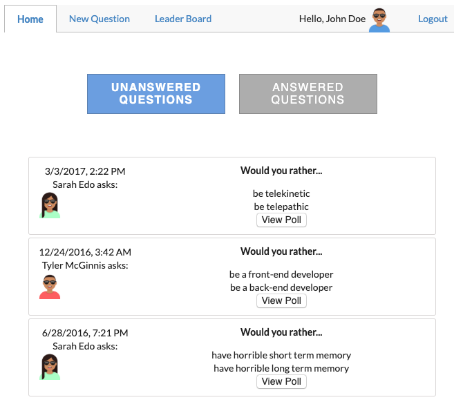

# Would You Rather

The "Would You Rather" app lets users create and answer simple questions (polls) which have two options. The app provides a user login (simulated by simple selection) and has 3 main parts:

### 1. Home
    
The default view, this provides buttons to select either "Unanswered" or "Answered" questions, and lists question teaser blocks for the appropriate class of questions for the selected user. 

### 2. New Question

This view allows the user to submit two options for a new question, which will show up at the top of the Home view.

### 3. Leader Board

This view computes scores for each user (the number of questions answered + questions asked) and lists them in order.

### Question page

Each question has its own page. If the user hasn't answered the question, they are prompted to do so. If they have, the results of the poll are shown, including which option they chose.

## Install

1. npm i
2. npm start

## Use

Use this app at the localhost port used by `npm start` (usually [http://localhost:3000](http://localhost:3000)).

## Screenshots

